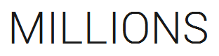

# Millions

Millions is a JavaFX-based stock trading simulation developed as a mappeprosjekt in IDATT2003 at NTNU.



The player starts with a fixed amount of money and trades stocks across weekly market updates. The goal is to grow net worth through buying and selling shares while tracking portfolio performance, transaction history, and market movements.

## Group Members
- Sigurd Mjølstad-Svendsen
- Atle Sandnes Halvorsen

## Features
- Start a new game
- Load a previously saved game
- Manual save and autosave
- Weekly market progression
- Buy and sell shares
- Sell all holdings
- Portfolio overview and transaction history
- Dashboard with net worth development
- End-game summary
- Random market events and rumors
- Detailed stock analysis from both Market and Portfolio views

## Technologies and Architecture

The project is built with:
- Java 25
- JavaFX
- Maven
- JUnit 5
- Jackson for JSON save/load

The application follows an MVC-inspired structure with separate packages for:
- `model`
- `view`
- `controller`
- `exchange`
- `transaction`
- `filehandling`
- `event`

The project also uses observer-based updates between the model and UI where appropriate.

## Installation

1. Download the latest release as a ZIP file from the GitHub release page, or clone the repository
2. Extract the ZIP file to a folder of your choice
3. Open the project in an IDE that supports Maven (e.g. IntelliJ IDEA or VS Code)
4. Wait for Maven to download all dependencies automatically
5. Run the application using the command below

This project requires **Java 25** to be installed on your machine.

## Running the Project

To run the application from the terminal in the project root:

```bash
mvn javafx:run
```

If needed, compile first:

```bash
mvn compile
```

## Running Tests

To run all tests:

```bash
mvn test
```

## Stock Data Format

To start a new game, the player must select a CSV file containing the stocks available on the exchange. The file must follow this format:

 - symbol,company,price
 - AAPL,Apple Inc.,180.50
 - GOOG,Alphabet Inc.,140.20
 - MSFT,Microsoft Corporation,420.75

Rules:
- The first line is a header and is required
- Each row represents one stock with three fields: ticker symbol, company name, and starting sales price
- The starting price must be a positive number
- Fields are separated by a comma
- Decimal numbers use a period as separator (`180.50`, not `180,50`)

An example CSV file is included in the project for reference.

## Save Files

Game saves are stored as JSON files.
- Manual saves can be created from the in-game shell
- Autosave is written automatically when advancing to the next week
- Save files are stored in the `saves/` directory

## Project Structure

- `src/main/java/no/ntnu/idatt2003/group38`
- `src/test/java/no/ntnu/idatt2003/group38`
- `src/main/resources`
